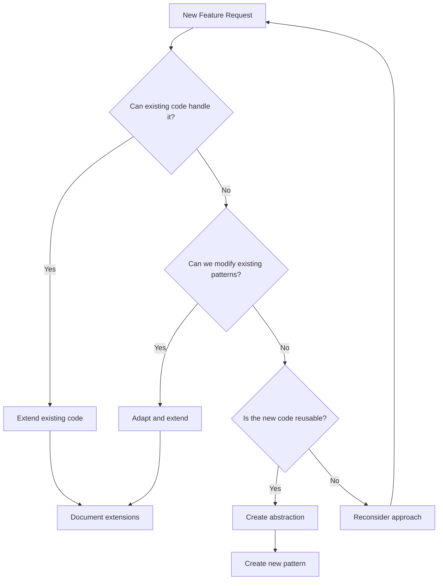

# Code Optimization Principles & Extended Thinking Framework

## Overview

This document establishes optimization principles based on successful patterns. These principles leverage extended thinking methodologies to ensure thorough analysis before implementation.

## Core Philosophy

> **"The best code is no code. The second best code is code that already exists and works."**

---

## The LEVER Framework

| Letter | Principle | Description |
|--------|-----------|-------------|
| **L** | Leverage | Use existing patterns first |
| **E** | Extend | Modify before creating new |
| **V** | Verify | Test through reactivity |
| **E** | Eliminate | Remove duplication |
| **R** | Reduce | Minimize complexity |

---

## 🧠 Extended Thinking Process

Follow this decision tree for every new feature:



---

## 📋 Pre-Implementation Checklist

### 1. Pattern Recognition Phase (10-15 minutes)

```markdown
## Existing Pattern Analysis

- [ ] What similar functionality already exists?
- [ ] Which functions handle related data?
- [ ] What UI components display similar information?
- [ ] Which classes manage related state?

## Code Reuse Opportunities

- [ ] Can I extend an existing class instead of creating a new one?
- [ ] Can I add methods to an existing service?
- [ ] Can I enhance an existing component with new properties?
- [ ] Can I modify an existing function with conditional logic?
```

### 2. Complexity Assessment (5-10 minutes)

```markdown
## Proposed Solution Complexity

- Lines of new code: ___
- New files created: ___
- New classes created: ___
- New functions created: ___

## Optimized Alternative

- Lines extending existing code: ___
- Files modified: ___
- Methods added to existing classes: ___
- Existing functions enhanced: ___
```

**Rule**: If optimized < 50% of proposed, proceed with optimization.

---

## 🏗️ Architecture Principles

### 1. Class Extensions

#### ❌ Anti-Pattern: Creating New Classes

```python
# DON'T: Create separate tracking class
class CampaignTracker:
    def __init__(self):
        self.user_id = None
        self.source = None
        self.medium = None
        # ... 10 more fields

# Requires separate instances, sync logic
```

#### ✅ Pattern: Extend Existing Classes

```python
# DO: Add attributes to existing class
class MetadataService:
    _tags = {}
    
    # ... existing methods ...
    
    # Campaign tracking (minimal additions)
    @classmethod
    def set_campaign_source(cls, path, source):
        if path not in cls._tags:
            cls._tags[path] = {}
        cls._tags[path]["campaign_source"] = source
        cls.save_tags()
```

### 2. Function Optimization

#### ❌ Anti-Pattern: Duplicate Function Logic

```python
# DON'T: Create similar functions
def get_trial_users(): pass
def get_active_trials(): pass
def get_expiring_trials(): pass
```

#### ✅ Pattern: Extend Existing Functions

```python
# DO: Add parameters to existing function
def get_user_status(include_trial=False, include_campaign=False):
    status = {
        # ... existing fields ...
    }
    
    if include_trial:
        status["trial_days_remaining"] = calculate_days_remaining()
    
    if include_campaign:
        status["is_from_campaign"] = bool(get_campaign_source())
    
    return status
```

### 3. UI State Management

#### ❌ Anti-Pattern: New Methods for Similar Data

```python
# DON'T: Create overlapping methods
def get_trial_status(self): pass
def get_campaign_data(self): pass
def get_user_metrics(self): pass
```

#### ✅ Pattern: Enhance Existing Methods

```python
# DO: Extend existing method with computed properties
def refresh_files(self, include_analytics=True):
    # ... existing implementation ...
    
    if include_analytics:
        # Add computed properties for new features
        self.update_analytics(files_data)
        self.should_show_campaign_badge = self.has_campaign_source()
```

---

## 🔄 Python/Tkinter-Specific Optimizations

### 1. Leverage Event System

```python
# ❌ DON'T: Manual state synchronization
self.user_data = None
self.trial_data = None
self.after(1000, self.poll_updates)  # Polling

# ✅ DO: Use callbacks and observers
self.search_var.trace_add("write", lambda *args: self.debouncer.trigger())
# Automatically updates when data changes
```

### 2. Use Class/Instance Method Split

```python
# Service operations (class-level, shared)
class MetadataService:
    @classmethod
    def set_tag(cls, path, **kwargs):
        # Shared across all instances
        pass

# UI operations (instance-level, per-panel)
class FolderCard:
    def refresh_files(self):
        # Instance-specific behavior
        pass
```

### 3. Optimize with Existing Patterns

```python
# ❌ DON'T: Create redundant caching
self.tag_cache = {}
self.file_cache = {}
self.icon_cache = {}

# ✅ DO: Reuse existing class-level storage
class MetadataService:
    _tags = {}  # Already exists, extend it
    
    @classmethod
    def get_tag_with_defaults(cls, path, defaults=None):
        return cls._tags.get(path, defaults or {})
```

---

## 📊 Decision Framework

### When to Extend vs Create New

| Criteria | Extend (+) | Create New (-) |
|----------|------------|----------------|
| Similar data structure exists | +3 | -3 |
| Can reuse existing methods | +2 | -2 |
| Existing classes handle related data | +3 | -3 |
| UI components show similar info | +2 | -2 |
| Would require <50 lines to extend | +3 | -3 |
| Would introduce circular dependencies | -5 | +5 |
| Significantly different domain | -3 | +3 |

**Scoring**:
- Score > 5: **Extend existing code**
- Score < -5: **Create new implementation**
- Score -5 to 5: **Deeper analysis required**

---

## 🛠️ Implementation Strategies

### The Three-Pass Approach

#### Pass 1: Discovery (No Code)
- Find all related existing code
- Document current patterns
- Identify extension points

#### Pass 2: Design (Minimal Code)
- Write interface changes only
- Update type hints
- Plan data flow

#### Pass 3: Implementation (Optimized Code)
- Implement with maximum reuse
- Add only essential new logic
- Document why choices were made

### Code Reuse Patterns

#### Pattern: Feature Flags in Existing Components

```python
# Instead of new component
def refresh_files(self, show_analytics=True, show_tags=True):
    # ... existing implementation ...
    
    # Conditionally show new features
    if show_analytics:
        self.update_analytics(files_data)
    
    if show_tags:
        self.apply_tag_highlighting()
```

#### Pattern: Computed Properties

```python
# Instead of new methods, add computed properties
def get_file_info(self, filepath, include_metadata=False):
    stats = os.stat(filepath)
    
    info = {
        "size": stats.st_size,
        "modified": stats.st_mtime,
    }
    
    if include_metadata:
        # Derived properties from existing data
        info["is_large"] = stats.st_size > 10_000_000
        info["is_recent"] = (time.time() - stats.st_mtime) < 86400
    
    return info
```

---

## ⚡ Performance Optimization Rules

### 1. Method Efficiency

```python
# ❌ Multiple calls
user = self.get_user()
subscription = self.get_subscription()
usage = self.get_usage()

# ✅ Single method returning all data
status = self.get_user_status()
# Returns user + subscription + usage in one call
```

### 2. Lazy Loading

```python
# ❌ Load everything at init
def __init__(self):
    self.load_all_data()
    self.build_all_ui()

# ✅ Load on demand
def __init__(self):
    self.data = None  # Lazy

def get_data(self):
    if self.data is None:
        self.data = self.load_data()
    return self.data
```

### 3. Batch Operations

```python
# ❌ Sequential operations
for item in items:
    self.process_item(item)
    self.save_item(item)

# ✅ Batch processing
processed = [self.process_item(item) for item in items]
self.save_all(processed)
```

---

## 🚫 Anti-Patterns to Avoid

### 1. The "Just One More Class" Trap

Each new class adds:
- Import complexity
- Instance management
- Initialization overhead
- Testing requirements

**Ask**: Can this functionality live in an existing class?

### 2. The "Similar But Different" Excuse

Before creating `get_user_trial_status` when `get_user_status` exists:
- Can `get_user_status` return trial fields?
- Can we add an `include_trial` parameter?
- Can computed properties derive what we need?

### 3. The "UI Drives Logic" Mistake

Never create logic structure to match UI components. Instead:
- Store data in its most logical form
- Use methods to transform for UI
- Let components compute display values

---

## 📝 Documentation Requirements

When extending existing code:

```python
def get_user_status(self, include_campaign=False):
    """Get user status with optional campaign data.
    
    OPTIMIZATION: Added campaign fields here instead of creating
    separate CampaignTracker class. Saves complexity and maintains
    data locality. See: optimization-doc-2025-12-08
    
    Args:
        include_campaign: Include campaign tracking data
        
    Returns:
        Dict with user status and optionally campaign data
    """
    status = {
        # ... existing fields ...
    }
    
    if include_campaign:
        status["campaign_source"] = self.get_campaign_source()
    
    return status
```

---

## 🎯 Success Metrics

| Metric | Target |
|--------|--------|
| Code reduction vs initial approach | >50% |
| Reused existing patterns | >70% |
| New files created | <3 per feature |
| New classes created | 0 (extend existing) |
| Implementation time | <50% of estimate |

---

## 🔍 Review Checklist

Before submitting optimized code:

- [ ] Extended existing classes instead of creating new ones
- [ ] Reused existing methods with additions
- [ ] Leveraged existing components
- [ ] No duplicate state management logic
- [ ] Documented why extensions were chosen
- [ ] Maintained backward compatibility
- [ ] No circular dependencies introduced
- [ ] Performance same or better
- [ ] Code reduction >50%

---

## 📚 Work Dashboard Examples

### Existing Patterns to Leverage

| Pattern | Location | Can Extend |
|---------|----------|------------|
| Singleton Service | `services/metadata_service.py` | Add new tag types |
| Clipboard | `services/clipboard.py` | Add new operations |
| File Info | `utils/files.py` | Add computed properties |
| Debouncing | `utils/debounce.py` | Parameterize delay |
| Theming | `ui/styles.py` | Add new themes |
| Panel Component | `ui/folder_card.py` | Add conditional features |

### Extension Points

```python
# MetadataService - add methods, not classes
MetadataService.set_priority(path, level)  # Extend existing

# FolderCard - add parameters, not subclasses  
FolderCard.refresh_files(show_hidden=True)  # Extend existing

# Styles - add to dicts, not new files
THEMES["HighContrast"] = {...}  # Extend existing
```

---

> **Remember**: Every line of code is a liability. The best feature is one that requires no new code, just better use of what exists.
