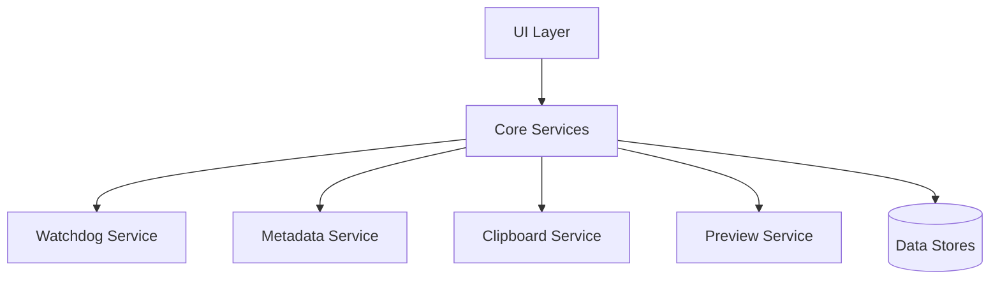
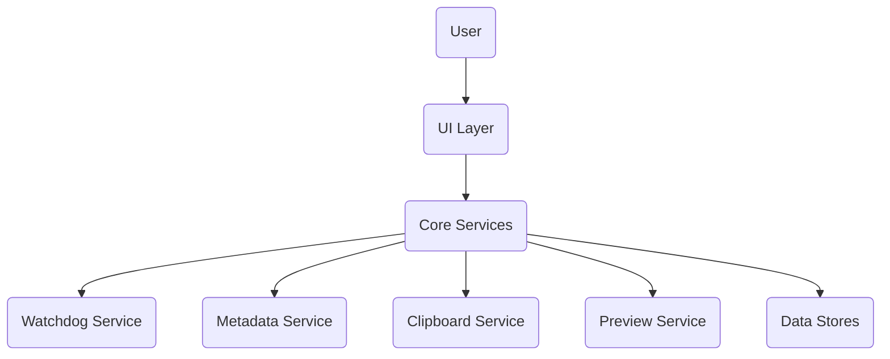

# Comprehensive Technical Report: Work Dashboard Application

## 1. Overview and Purpose

The Work Dashboard is a sophisticated file management application designed to enhance productivity for users who work with multiple directories and large numbers of files. Built using Python and the CustomTkinter GUI framework, it provides a multi-panel interface that allows simultaneous browsing and management of several folders.

### Purpose
- **Productivity Enhancement**: Enable efficient file organization and operations across multiple workspaces
- **Visual File Management**: Provide intuitive, color-coded file browsing with analytics
- **Tagging System**: Allow users to mark important files with colors and notes for quick retrieval
- **Real-time Monitoring**: Keep file views updated automatically when changes occur
- **Workspace Persistence**: Save and restore custom configurations for different projects

### Target Users
- Professionals managing large document collections
- Developers working with multiple project directories
- Data analysts handling various file types
- Anyone requiring advanced file organization capabilities

## 2. Detailed Feature List with Descriptions

### Core Features

#### Multi-Panel File Browser
- **Description**: Displays 2-9 folder panels in configurable layouts (Grid, Vertical, Horizontal)
- **Functionality**: Each panel shows files in a treeview with name, size, and modification date columns
- **Operations**: Browse folders, navigate up/down directory tree, open files and folders

#### File Operations
- **Basic Operations**: Copy, cut, paste, rename, delete files
- **Advanced Operations**: Move files between panels, bulk operations for multiple selections
- **Clipboard Management**: Internal clipboard system for cross-panel file transfers

#### File Tagging and Metadata
- **Color Coding**: Tag files as Red (Very Important), Green (Important), Yellow (Review)
- **Notes**: Add custom notes to files for additional context
- **Tagged Files Modal**: Quick access to all tagged files grouped by color
- **Visual Indicators**: Tagged files display color highlights and note icons in the file list

#### Search and Filtering
- **Global Search**: Search across all panels simultaneously
- **Local Search**: Search within individual panels
- **Content Search**: Optional search within file contents for text files
- **Type Filtering**: Filter by file types (Excel, PDF, Word, Images, Text)
- **Debounced Search**: 300ms delay to prevent excessive searches during typing

#### Quick Look Previews
- **Image Preview**: Display images with automatic scaling
- **Text Preview**: Show first 10KB of text files with syntax highlighting
- **Excel Preview**: Display spreadsheet data in tabular format (requires pandas)
- **Fallback**: Open files in default system applications for unsupported types

#### Analytics Dashboard
- **File Statistics**: Display total file count and combined size
- **Type Distribution**: Visual bar chart showing file type proportions
- **Color Coding**: Different colors for Excel (Green), PDF (Red), Word (Blue), Images (Purple), etc.

#### Real-time Updates
- **File System Monitoring**: Uses watchdog library to detect changes
- **Automatic Refresh**: Updates file lists when files are added, removed, or modified
- **Debounced Updates**: Prevents excessive refreshes during rapid changes

#### Workspace Management
- **Save Workspaces**: Store panel configurations, layouts, and paths
- **Load Workspaces**: Restore saved configurations instantly
- **Workspace Names**: Custom naming for different projects or contexts

#### Customization
- **Themes**: Light and Dark themes with consistent color schemes
- **Font Sizing**: Adjustable font sizes (10-28pt) for accessibility
- **Layout Modes**: Flexible panel arrangements for different screen sizes
- **Accent Colors**: Unique colors for each panel for visual distinction

## 3. Architecture Diagram and Component Breakdown



### Component Breakdown

#### UI Layer (`ui/`)
- **dashboard.py**: Main application window with toolbar and panel management
- **folder_card.py**: Individual panel component with file browser and controls
- **quick_look.py**: Preview window for file content
- **styles.py**: Theme definitions and color constants

#### Core Services (`services/`)
- **clipboard.py**: Internal clipboard for file operations
- **metadata_service.py**: File tagging and note management
- **watchdog_service.py**: File system change monitoring
- **preview/excel_preview.py**: Excel file parsing for previews

#### Configuration (`config/`)
- **manager.py**: JSON-based configuration persistence

#### Utilities (`utils/`)
- **files.py**: File system operations and information retrieval
- **debounce.py**: Input debouncing for search operations

#### Data Stores
- **dashboard_config.json**: Application settings, workspaces, panel configurations
- **file_tags.json**: File metadata including colors and notes

## 4. Data Flow and Workflows



### Primary Workflows

#### File Browsing Workflow
1. User selects folder in panel
2. UI calls `set_path()` on FolderCard
3. FolderCard updates path and starts watchdog monitoring
4. `refresh_files()` loads directory contents
5. Files displayed in treeview with metadata overlays

#### File Tagging Workflow
1. User right-clicks file → Tags & Notes menu
2. UI calls MetadataService.set_tag()
3. MetadataService updates file_tags.json
4. FolderCard.refresh_files() updates display with new tags

#### Search Workflow
1. User types in search box
2. Debouncer triggers after 300ms delay
3. Search term applied to all panels
4. Each panel filters files by name/content
5. Treeviews update with filtered results

#### File Operations Workflow
1. User selects file and chooses operation (copy/cut)
2. InternalClipboard stores file path and operation
3. User navigates to target panel and pastes
4. Clipboard service performs file system operation
5. Both panels refresh to show changes

## 5. Implementation Steps with Code Structure

### Project Setup
1. Create directory structure as shown in file listing
2. Initialize virtual environment
3. Install dependencies: `pip install customtkinter watchdog pandas pillow`

### Core Implementation Sequence

#### Step 1: Configuration Management
```python
# config/manager.py - JSON persistence
class ConfigManager:
    @staticmethod
    def load_config(): # Load dashboard_config.json
    @staticmethod
    def save_config(data): # Save configuration
```

#### Step 2: Metadata Service
```python
# services/metadata_service.py - File tagging
class MetadataService:
    _tags = {}  # In-memory cache
    
    @classmethod
    def set_tag(cls, path, color=None, note=None):
        # Update _tags dict and save to file_tags.json
```

#### Step 3: Utility Functions
```python
# utils/files.py - File operations
def open_path(path): # Cross-platform file opening
def get_file_info(filepath): # Size, date, etc.
```

#### Step 4: Services Implementation
- **Clipboard Service**: Singleton pattern for file operations
- **Watchdog Service**: Event handler for file system changes
- **Preview Service**: File type detection and content extraction

#### Step 5: UI Components
```python
# ui/styles.py - Theme definitions
THEMES = {"Dark": {...}, "Light": {...}}
ACCENT_COLORS = ["#0078D4", "#107C10", ...]
TYPE_COLORS = {'.xlsx': '#107C10', ...}
```

#### Step 6: Folder Card Component
```python
# ui/folder_card.py - Main panel class
class FolderCard(ctk.CTkFrame):
    def __init__(self, parent, panel_id, accent_color, ...):
        # Initialize UI elements
        # Set up treeview, controls, analytics
    
    def refresh_files(self):
        # Load directory contents
        # Apply filters and search
        # Update analytics display
```

#### Step 7: Main Dashboard
```python
# ui/dashboard.py - Application container
class WorkDashboard(ctk.CTk):
    def __init__(self):
        # Initialize window and toolbar
        # Create panels based on configuration
        # Set up global search and controls
```

#### Step 8: Integration
```python
# main.py - Entry point
import customtkinter as ctk
from ui.dashboard import WorkDashboard

if __name__ == "__main__":
    app = WorkDashboard()
    app.mainloop()
```

### Key Classes and Methods

#### WorkDashboard (ui/dashboard.py)
- `__init__()`: Initialize application, load config, setup UI
- `setup_layout()`: Create panels in specified arrangement
- `change_theme()`: Apply theme changes immediately
- `open_workspace_menu()`: Manage saved configurations

#### FolderCard (ui/folder_card.py)
- `__init__()`: Create panel UI with treeview and controls
- `refresh_files()`: Load and display directory contents
- `on_right_click()`: Context menu with file operations
- `set_file_tag()`: Apply color/note tags to files

#### MetadataService (services/metadata_service.py)
- `set_tag()`: Add/update file metadata
- `get_tag()`: Retrieve file tags and notes
- `load_tags()`/`save_tags()`: JSON persistence

## 6. Configuration and Dependencies

### Dependencies
```txt
customtkinter==5.2.1      # Modern Tkinter wrapper
watchdog==3.0.0           # File system monitoring
pandas>=1.5.0             # Excel file processing (optional)
Pillow>=9.0.0             # Image processing
```

### Configuration Files

#### dashboard_config.json
```json
{
  "num_panels": 6,
  "layout_mode": "G",
  "theme_name": "Light",
  "font_size": 16,
  "workspaces": {
    "project1": {
      "num_panels": 4,
      "layout_mode": "V",
      "paths": {"1": "/path/to/folder1", ...}
    }
  },
  "1": "/default/path/1",
  "2": "/default/path/2"
}
```

#### file_tags.json
```json
{
  "/path/to/file.xlsx": {
    "color": "red",
    "note": "Important document"
  }
}
```

### Environment Requirements
- **Python**: 3.8+
- **OS**: Windows (primary), Linux/Mac (with modifications)
- **Display**: 1920x1080 minimum recommended
- **Memory**: 512MB minimum, 2GB recommended for large directories

## 7. Potential Challenges and Solutions

### Performance Challenges
**Challenge**: Slow loading of large directories (>1000 files)
**Solution**: Implement virtual scrolling, pagination, or background loading with progress indicators

**Challenge**: Memory usage for image previews
**Solution**: Limit preview sizes, implement lazy loading, cache scaled images

**Challenge**: Search performance on large file sets
**Solution**: Index file metadata, use background threading for content search

### Cross-Platform Compatibility
**Challenge**: File path handling differences (Windows vs Unix)
**Solution**: Use `os.path` functions consistently, normalize paths on load/save

**Challenge**: File opening commands differ by OS
**Solution**: Detect OS and use appropriate commands (`os.startfile` on Windows, `xdg-open` on Linux)

### User Experience Issues
**Challenge**: UI freezing during file operations
**Solution**: Move file operations to background threads, show progress dialogs

**Challenge**: Real-time updates causing UI lag
**Solution**: Increase debounce intervals, batch updates, use event queuing

### Data Integrity
**Challenge**: Configuration file corruption
**Solution**: Implement backup/restore, validate JSON on load, graceful fallbacks

**Challenge**: Tag file conflicts during concurrent access
**Solution**: Use file locking, implement retry logic, merge changes intelligently

### Scalability Concerns
**Challenge**: Memory usage with many open panels
**Solution**: Limit concurrent panels, implement panel virtualization

**Challenge**: Large tag databases
**Solution**: Implement tag database compression, lazy loading of metadata

### Development Challenges
**Challenge**: Tkinter threading limitations
**Solution**: Use `after()` for UI updates, separate worker threads for I/O

**Challenge**: CustomTkinter version compatibility
**Solution**: Pin versions in requirements.txt, test upgrades thoroughly

This comprehensive report provides all necessary information for replicating or extending the Work Dashboard application. The modular architecture and detailed implementation steps make it accessible for developers to build upon or create similar file management tools.